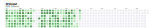

# Sync WeRead highlights and notes to Notions and Readwise

I cobbled together code snippets from various sources to create a somewhat fragile project that synchronizes my highlights from WeRead to Notion and Readwise.
Readwise excels at reviewing highlights, and I highly recommend it.

## WeRead Progress

## Reference

* [Original repo](https://github.com/malinkang/weread2notion)
* [Setup tutorial](https://www.bilibili.com/video/BV1xQ4y1H7Aw/?vd_source=327443858b210c796f6319cc12e9ea02)
* [Notion Template](https://malinkang.notion.site/e27842548a6d4a81bc7aea736d90d6dd?v=b255858d3eaa409f97f1ecb32a14a5b6)
